# 🗄️ End-to-End-Oracle-Database-Administration


-231F20?style=for-the-badge&logo=ssh&logoColor=white)


## 📌 Project Overview
Documents a complete hands-on **Oracle Database Administration workflow** showcasing **Oracle 19c database and Oracle Linux 8 setup inside Oracle VM VertualBox**, **remote MobaXterm(or PUTTY) & SQL Developer integration**, and execution of core DBA daily tasks.

This project covers a practical DBA workflow starting from virtual machine provisioning and Oracle environment verification to Multitenant Database administration, remote SSH access, Oracle networking, SQL Developer connectivity, tablespace management, user provisioning, and datafile capacity expansion.

---

## 📋 Project Overview

The environment used in this project consists of:

```text
Windows Host
│
├── Oracle VM VirtualBox
│   │
│   └── Oracle Linux 8
│       │
│       ├── Oracle Database 19c
│       │   ├── CDB: ORCL
│       │   ├── PDB$SEED
│       │   └── PDB1
│       │
│       └── Oracle Listener
│
├── MobaXterm
│   └── Remote SSH Administration
│
└── Oracle SQL Developer
    └── Remote Database Administration
```

The project focuses on practical DBA operations such as:

- Virtual machine provisioning
- Oracle Linux environment verification
- Oracle user and group configuration
- Oracle 19c installation verification
- Oracle environment variables
- Database startup and shutdown
- Oracle Multitenant Architecture
- CDB and PDB management
- PDB `SAVE STATE`
- Oracle Listener management
- Remote administration through SSH
- Oracle Net configuration
- Oracle SQL Developer connectivity
- Tablespace monitoring
- Application tablespace creation
- Database user provisioning
- Privilege management
- Application object creation
- Datafile resizing
- TEMP and UNDO verification

---

# 🛠️ Technologies & Tools

| Category | Technology / Tool |
|---|---|
| Virtualization | Oracle VM VirtualBox |
| Operating System | Oracle Linux 8 |
| Database | Oracle Database 19c |
| Database Architecture | Oracle Multitenant Architecture |
| Database CLI | SQL*Plus |
| Remote Administration | MobaXterm |
| Database Client | Oracle SQL Developer |
| Shell | Bash |
| Container Database | ORCL |
| Pluggable Database | PDB1 |

---

# 🚀 Project Implementation

## Phase 1: Virtual Infrastructure Provisioning

 Set up the underlying server hardware and operating system required for Oracle 19c.

**Tool Used:** Oracle VM VirtualBox

---

### Step 1.1: Create Oracle Linux Virtual Machine

A new virtual machine was created in Oracle VM VirtualBox using Oracle Linux 8.
The Oracle Linux ISO was attached to the virtual machine for operating system installation.

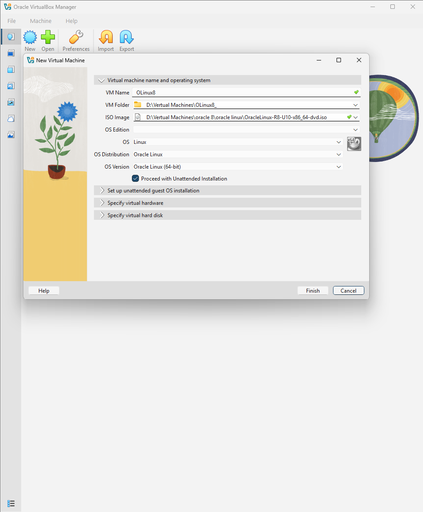

---

### Step 1.2: Configure Unattended Installation

Configured the unattended guest OS setup to automate the Linux installation.
We defined the default user as `kushal` and set the hostname to `OLinux8`.

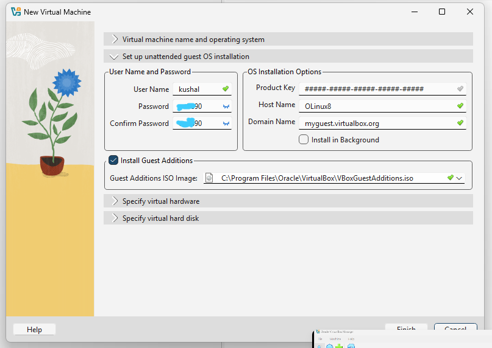

---

### Step 1.3: Configure Virtual Storage

Allocated a 20.00 GB dynamically allocated Virtual Hard Disk (VDI) to ensure sufficient space for OS, Oracle binaries, and database files.

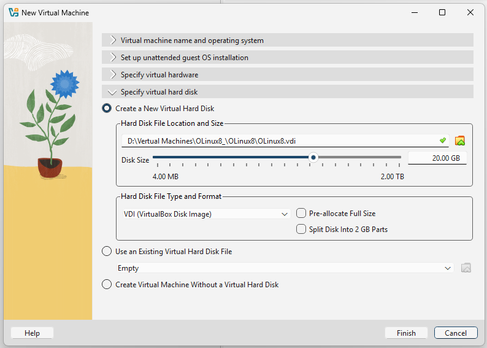

---

### Step 1.4: Configure VM Hardware

Finalized the VM specifications, allocating 5112 MB (5 GB) of Base Memory (RAM) and 2 CPU cores to meet Oracle 19c's minimum enterprise requirements.

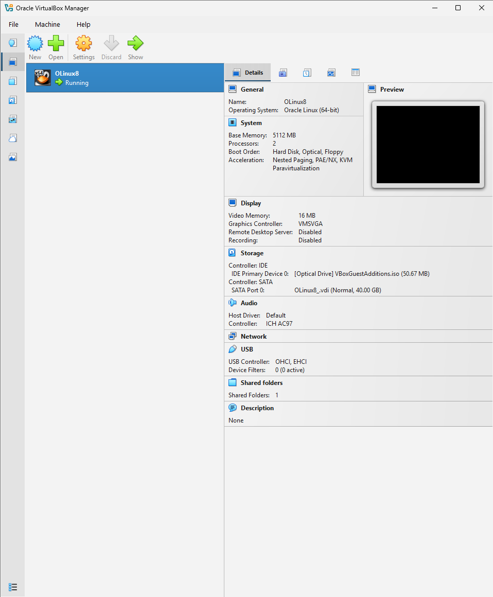

---

### Step 1.5: Boot Oracle Linux

Successfully booted into Oracle Linux 8 and reached the login screen for the OS administrator user (`kushal`).

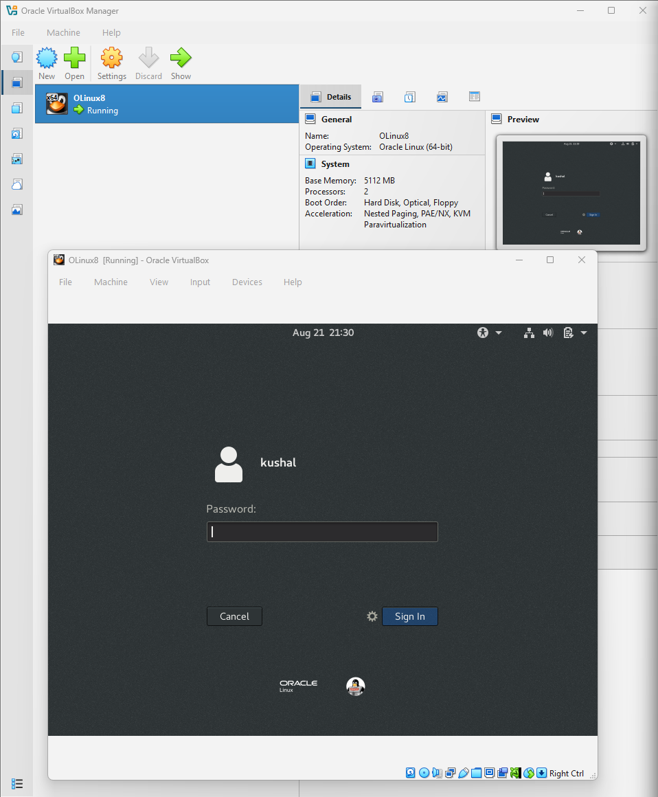

---

# Phase 2: Oracle Linux & Oracle User Configuration

After the operating system was available, the Oracle Database environment was prepared.
Prepare the Linux environment by creating necessary Oracle groups, users, and resolving GUI access for the installer.

**Tool Used:** Oracle Linux 8 Terminal

---

### Step 2.1: Create Oracle Groups and Oracle User

Logged in as `root` to create the standard Oracle inventory and database administrator groups, followed by the `oracle` software owner user.
**Commands Executed:**
```bash
groupadd oinstall
groupadd dba
useradd -g oinstall -G dba oracle
passwd oracle


```
The standard Oracle groups were created.
---

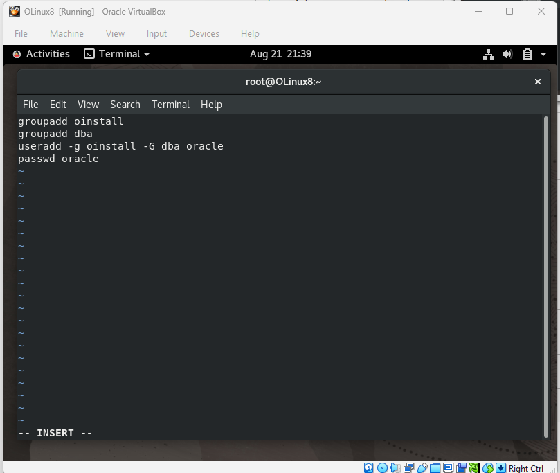

---

### Step 2.2: X11 Display Forwarding & Oracle 19c Enterprise Installation
 To securely launch the Oracle Universal Installer (OUI) GUI from the terminal, X11 access control was disabled by the screen owner (`kushal`). After switching to the `oracle` user, exporting the display variable, and launching `./runInstaller`, the following enterprise-level configurations were defined in the GUI to build the infrastructure:

* **Installation Type:** Selected *Create and configure a single instance database* (Server Class, Enterprise Edition).
* **Storage Allocation:** Mapped Oracle Base to `/u01/app/oracle` and Oracle Home to `/u01/app/oracle/product/19c/dbhome_1`.
* **Multitenant Architecture:** Provisioned a Container Database (Global Database Name: **`ORCL`**) and a dedicated Pluggable Database (**`PDB1`**).
* **Memory & Character Set:** Configured Automatic Memory Management (AMM) and set the database character set to `AL32UTF8`.
* **Root Scripts Execution:** Suspended the installer midway to manually execute `orainstRoot.sh` and `root.sh` via the root terminal, finalizing OS-level privileges and inventory registration.

**Commands Executed:**
```bash
whoami  # (Verified user: kushal)
xhost +
su - oracle
export DISPLAY=:0
cd /u01/app/oracle/product/19c/dbhome_1
./runInstaller


```

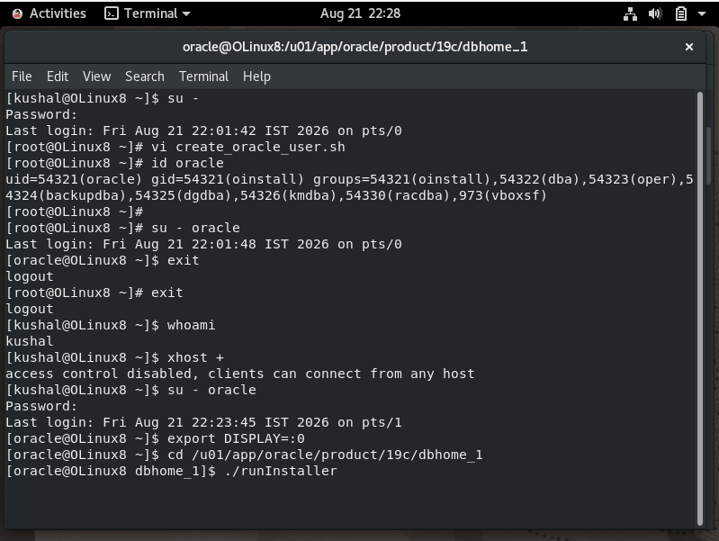

---

# Phase 3: Oracle 19c Environment Verification

The Oracle Database installation and environment configuration were verified from Oracle Linux.

**Tool Used:** Oracle Linux Terminal

---

### Step 3.1: Silent Installation Verification (opatch)

Bypassed the GUI and used Oracle's opatch utility to definitively prove that Oracle Database 19c (19.0.0.0.0) was successfully installed in the Oracle Home directory.

```bash
/u01/app/oracle/product/19c/dbhome_1/OPatch/opatch lsinventory
```

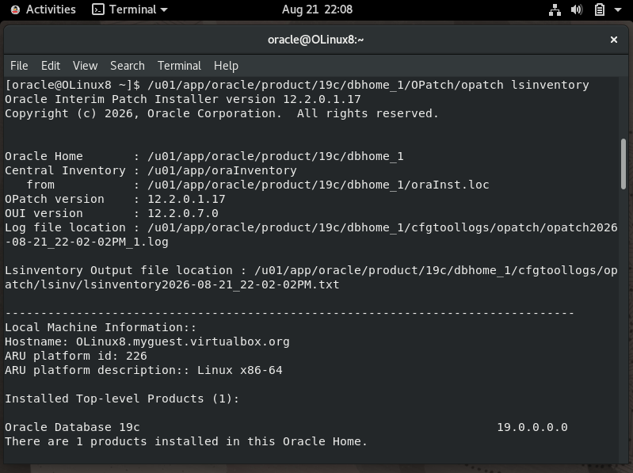

---

### Step 3.2: Logs, OS Packages, and Auto-Start Check

Verified the installation logs exist, confirmed the Oracle pre-installation RPMs are present (which configure kernel limits), and checked /etc/oratab for instance registration.
Commands Executed:

Bash

```bash
ls -ltr /u01/app/oraInventory/logs/
rpm -qa | grep oracle-database-preinstall
cat /etc/oratab | grep -v "^#"
```


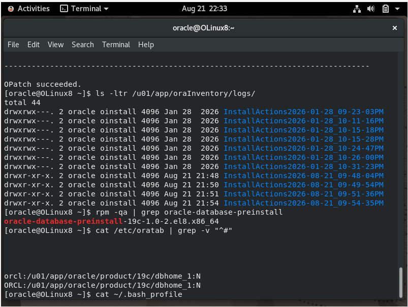

---

### Step 3.3: Bash Profile Automation & Process Check

Verified the ~/.bash_profile for the oracle user to ensure $ORACLE_HOME and $ORACLE_SID load automatically. We then checked if the background process Monitor (pmon) was running.

```bash
cat ~/.bash_profile
```

The environment variables included Oracle configuration such as:

```bash
export ORACLE_BASE=/u01/app/oracle
export ORACLE_HOME=$ORACLE_BASE/product/19c/dbhome_1
export ORACLE_SID=ORCL
export PATH=$PATH:$ORACLE_HOME/bin
export LD_LIBRARY_PATH=$ORACLE_HOME/lib
```

The Oracle environment variables were also checked directly.

```bash
echo $ORACLE_SID
echo $ORACLE_HOME
```

The Oracle Process Monitor was checked.

```bash
ps -ef | grep pmon
```
---

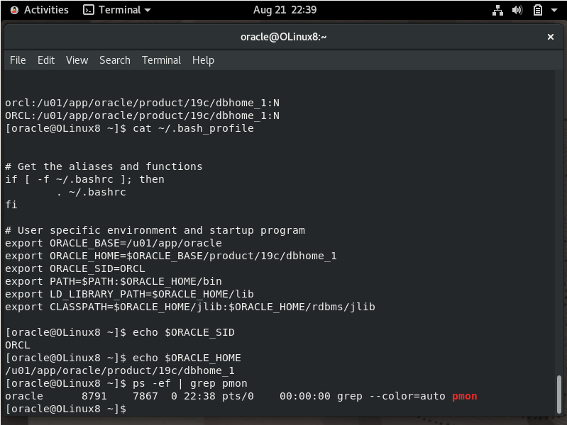

---

# Phase 4: Database Startup & Core DBA Operations

**Tools Used:**

- Oracle Linux Terminal
- SQL*Plus

---

### Step 4.1: Connect as SYSDBA

SQL*Plus was launched using OS authentication.

```bash
sqlplus / as sysdba
```

---

### Step 4.2: Start Oracle Database

The database was started.

```sql
startup;
```

The listener registration was then refreshed.

```sql
alter system register;
```

Exit SQL*Plus:

```sql
exit
```

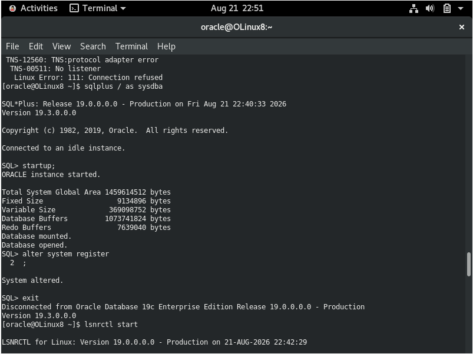

---

### Step 4.3: Verify Oracle Instance

The Oracle instance status and version were checked.

```sql
select instance_name,
       status,
       version
from v$instance;
```

This verifies:

- Instance name
- Current instance status
- Oracle Database version

---

### Step 4.4: Verify Database Status

The database status was checked.

```sql
select name,
       db_unique_name,
       open_mode
from v$database;
```

The expected open mode is generally:

```text
READ WRITE
```

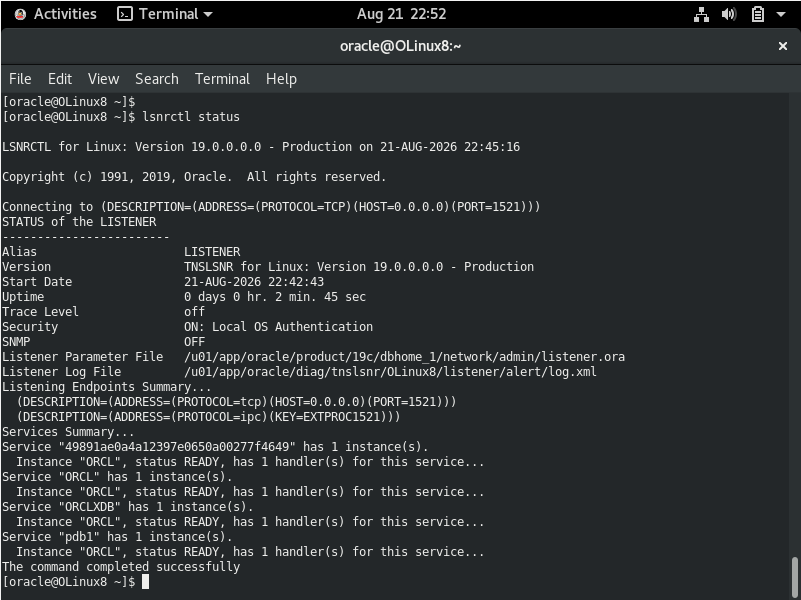

---

# Phase 5: Oracle Multitenant Architecture

The Oracle Database environment uses Multitenant Architecture.

```text
CDB$ROOT
│
├── PDB$SEED
│
└── PDB1
```

---

### Step 5.1: Check Available PDBs

The available Pluggable Databases were checked.

```sql
show pdbs;
```

The environment includes:

```text
PDB$SEED
PDB1
```

---

### Step 5.2: Open PDB1

The application Pluggable Database was opened.

```sql
alter pluggable database pdb1 open;
```

---

### Step 5.3: Save PDB State

The state of `PDB1` was saved.

```sql
alter pluggable database pdb1 save state;
```

This allows `PDB1` to automatically return to its saved state after a CDB restart.

The PDB status was verified again.

```sql
show pdbs;
```

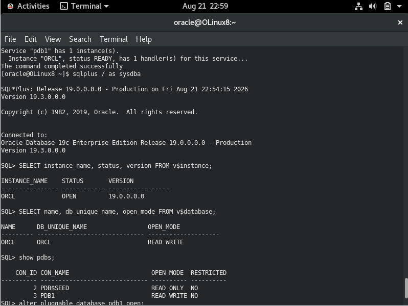

---

# Phase 6: Oracle Listener Administration

The Oracle Listener is responsible for accepting client connections and forwarding them to the Oracle Database services.

**Tool Used:** Oracle Linux Terminal

---

### Step 6.1: Check Listener Status

The listener status was checked.

```bash
lsnrctl status
```

This verifies that the listener is running and database services are registered.

---

### Step 6.2: Register Database Services

If required, the database services can be manually registered.

Connect as SYSDBA:

```bash
sqlplus / as sysdba
```

Execute:

```sql
alter system register;
```

Then verify the listener again:

```bash
lsnrctl status
```

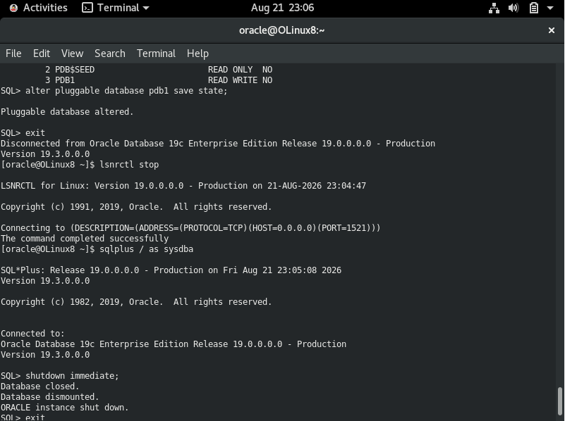

---

# Phase 7: Graceful Database Shutdown

A controlled database shutdown was performed.

First, the listener was stopped.

```bash
lsnrctl stop
```

Then SQL*Plus was opened.

```bash
sqlplus / as sysdba
```

The database was shut down using:

```sql
shutdown immediate;
```

Exit SQL*Plus:

```sql
exit
```

A graceful shutdown helps ensure that database activity is properly completed before the instance stops.

---

### Step 7.1: Restart Database Services

The listener was started again.

```bash
lsnrctl start
```

The database was started.

```bash
sqlplus / as sysdba
```

```sql
startup;
```

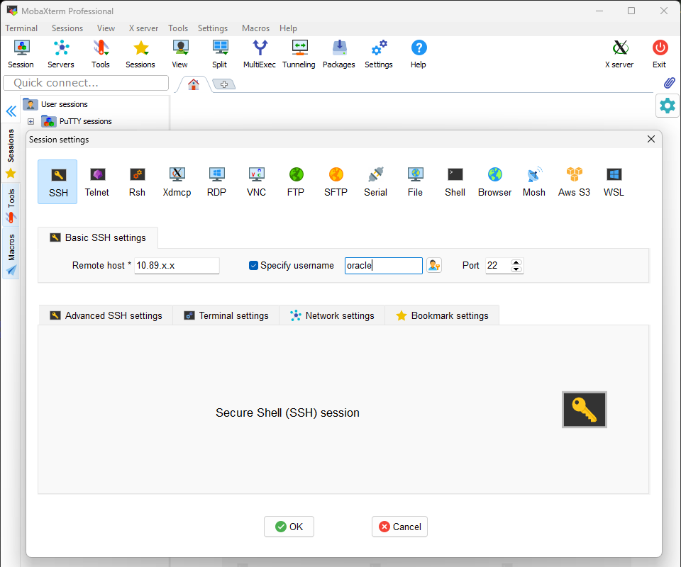

---

# Phase 8: Remote Administration Using MobaXterm

A remote SSH connection was configured from the Windows host to the Oracle Linux virtual machine.

**Tool Used:** MobaXterm

---

### Step 8.1: Configure SSH Session

A new SSH session was created using the Oracle Linux VM IP address.

The connection was configured for the Oracle Linux server.

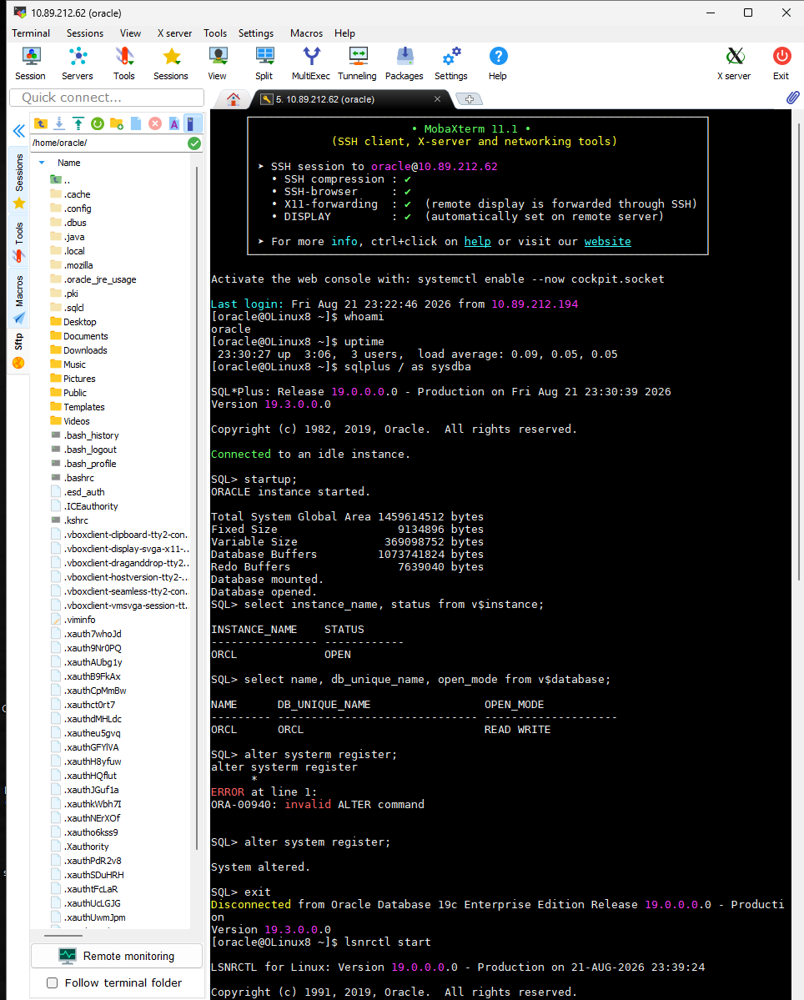

---

### Step 8.2: Verify Remote Server Access

After connecting through SSH, the server environment was checked.

```bash
whoami
```

Check system uptime:

```bash
uptime
```

The database was then accessed remotely.

```bash
sqlplus / as sysdba
```

Start the database if required:

```sql
startup;
```

Verify the instance:

```sql
select instance_name,
       status
from v$instance;
```

Verify database status:

```sql
select name,
       db_unique_name,
       open_mode
from v$database;
```

Refresh listener registration:

```sql
alter system register;
```

Exit:

```sql
exit
```

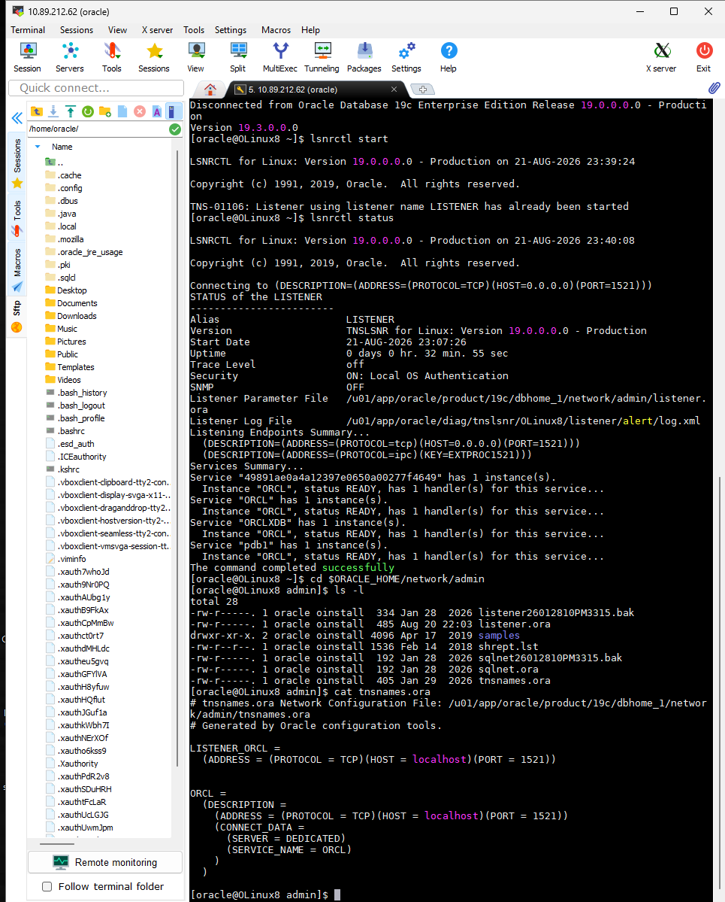

---

# Phase 9: Oracle Net Configuration

The Oracle Net configuration files were checked from the Oracle Linux server.

---

### Step 9.1: Start Listener

```bash
lsnrctl start
```

Check the listener:

```bash
lsnrctl status
```

---

### Step 9.2: Access Oracle Net Configuration

Navigate to the Oracle Network configuration directory.

```bash
cd $ORACLE_HOME/network/admin
```

List the available files.

```bash
ls -l
```

Check the `tnsnames.ora` configuration.

```bash
cat tnsnames.ora
```

The configuration contains database connection information such as:

- Host
- Port
- Service Name

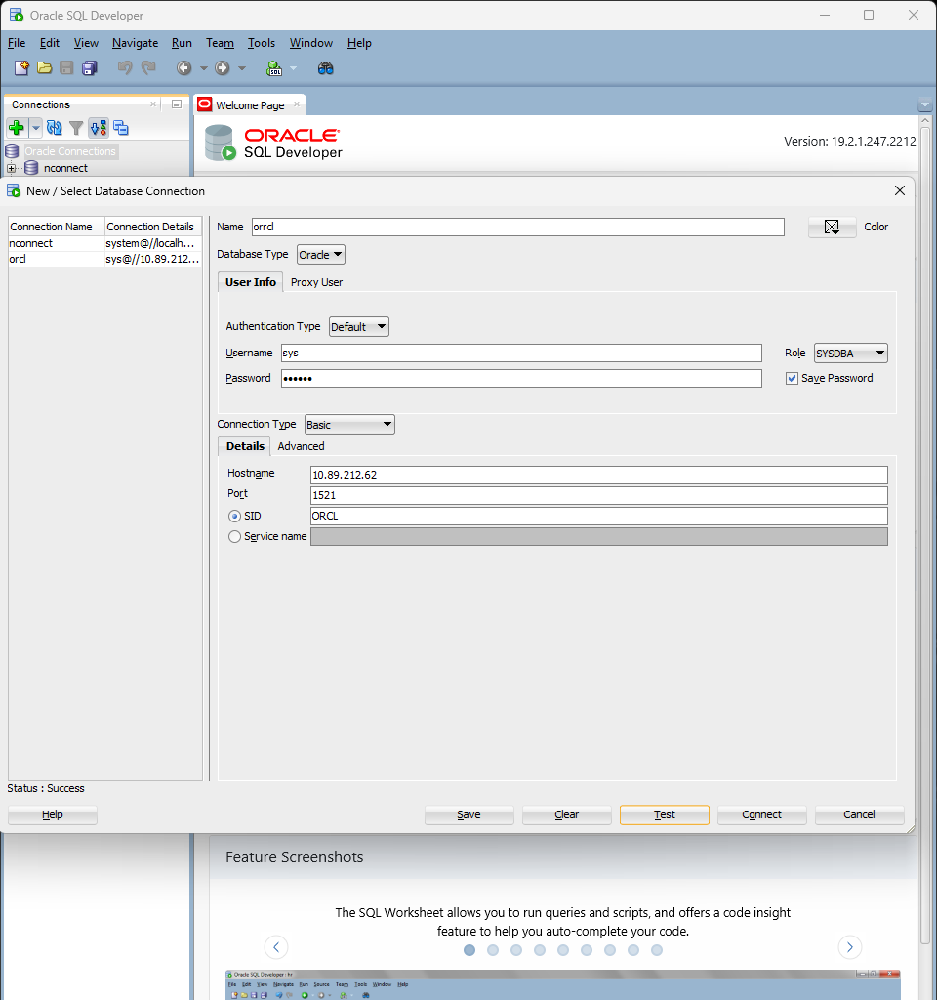

---

# Phase 10: Connect Oracle SQL Developer

A remote database connection was configured from the Windows host.

**Tool Used:** Oracle SQL Developer

---

### Step 10.1: Create SYSDBA Connection

The connection was configured with parameters similar to:

```text
Host: <Oracle Linux VM IP>
Port: 1521
Username: SYS
Role: SYSDBA
SID / Database: ORCL
```

The connection test returned a successful status.

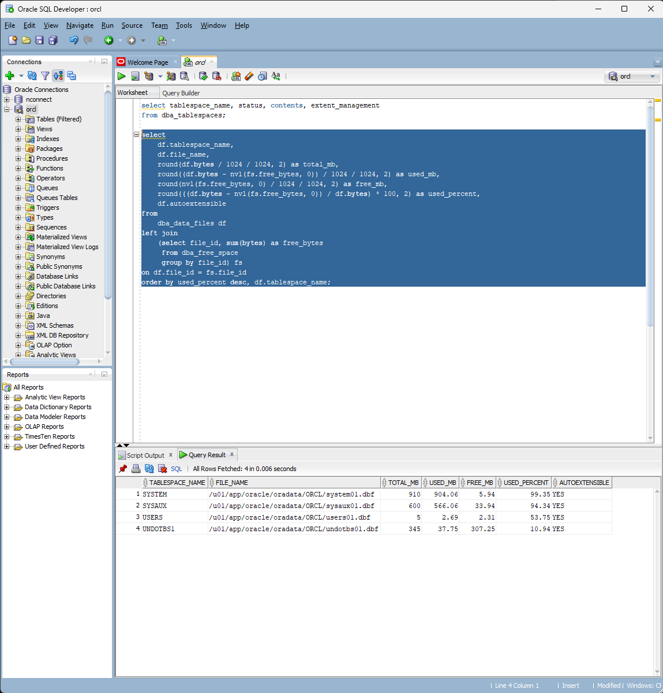

---

# Phase 11: Tablespace Health Check

The database storage was monitored using Oracle SQL Developer.

**Tool Used:** Oracle SQL Developer

---

### Step 11.1: Generate Tablespace Usage Report

A detailed query was executed to monitor:

- Tablespace name
- Datafile
- Total size
- Used space
- Free space
- Used percentage
- Autoextend status

```sql
select 
    df.tablespace_name, 
    df.file_name,
    round(df.bytes / 1024 / 1024, 2) as total_mb, 
    round((df.bytes - nvl(fs.free_bytes, 0)) / 1024 / 1024, 2) as used_mb, 
    round(nvl(fs.free_bytes, 0) / 1024 / 1024, 2) as free_mb, 
    round(
        ((df.bytes - nvl(fs.free_bytes, 0)) / df.bytes) * 100,
        2
    ) as used_percent,
    df.autoextensible
from dba_data_files df
left join 
(
    select file_id,
           sum(bytes) as free_bytes
    from dba_free_space
    group by file_id
) fs
on df.file_id = fs.file_id
order by used_percent desc,
         df.tablespace_name;
```

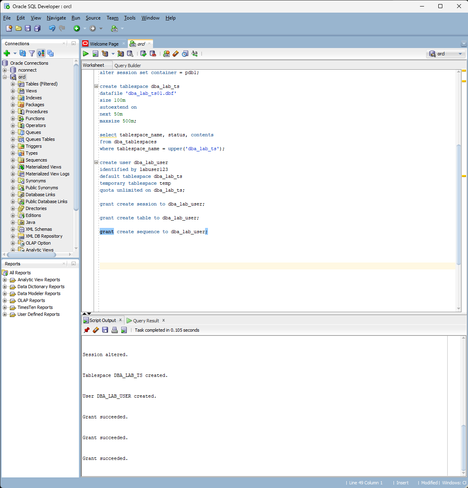

---

# Phase 12: PDB Storage Provisioning

A dedicated application tablespace was created inside `PDB1`.

---

### Step 12.1: Switch to PDB1

```sql
alter session set container = pdb1;
```

The current container can be verified using:

```sql
show con_name;
```

Expected output:

```text
PDB1
```

---

### Step 12.2: Create Application Tablespace

A dedicated tablespace named `DBA_LAB_TS` was created.

```sql
create tablespace dba_lab_ts
datafile 'dba_lab_ts01.dbf'
size 100m
autoextend on
next 50m
maxsize 500m;
```

The tablespace was verified.

```sql
select tablespace_name,
       status,
       contents
from dba_tablespaces
where tablespace_name = upper('dba_lab_ts');
```

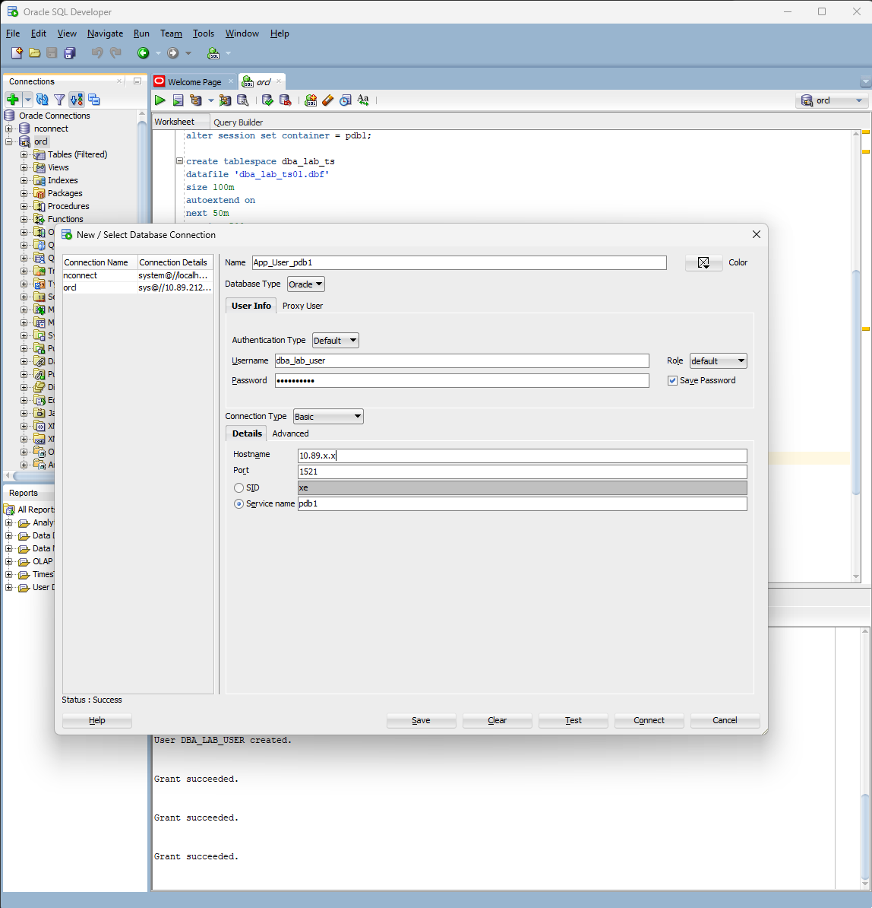

---

# Phase 13: Create Application Database User

A dedicated application user was created inside `PDB1`.

```sql
create user dba_lab_user
identified by labuser123
default tablespace dba_lab_ts
temporary tablespace temp
quota unlimited on dba_lab_ts;
```

The required privileges were granted.

```sql
grant create session to dba_lab_user;
```

```sql
grant create table to dba_lab_user;
```

```sql
grant create sequence to dba_lab_user;
```

This user can now connect to the database and create objects inside the assigned application tablespace.

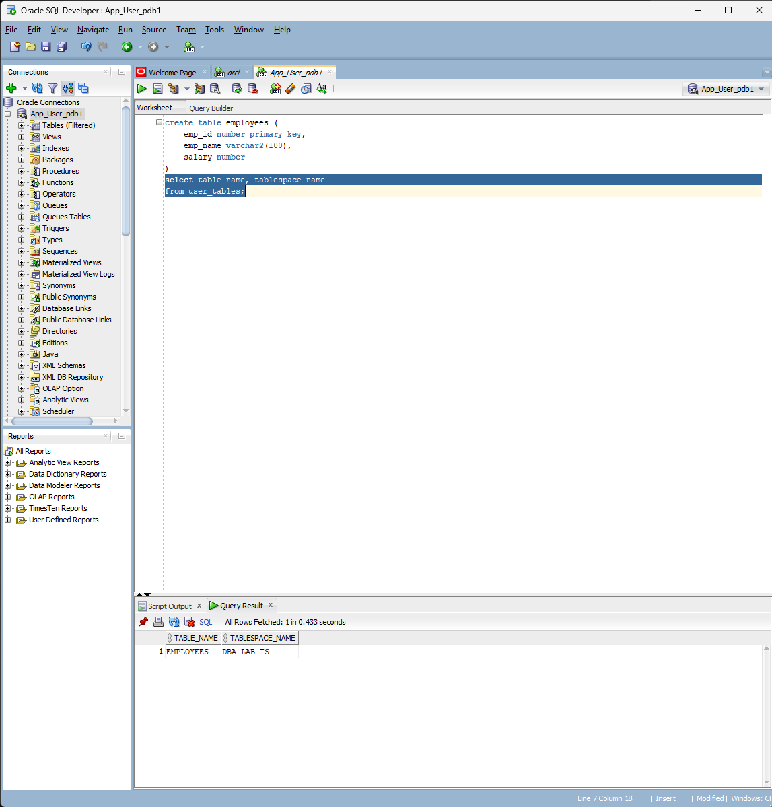

---

# Phase 14: Application User Connection

A separate Oracle SQL Developer connection was created for the application user.

The connection used:

```text
Username: DBA_LAB_USER
Service Name: PDB1
Port: 1521
Host: <Oracle Linux VM IP>
```

This connection targets the `PDB1` service rather than the CDB SID.

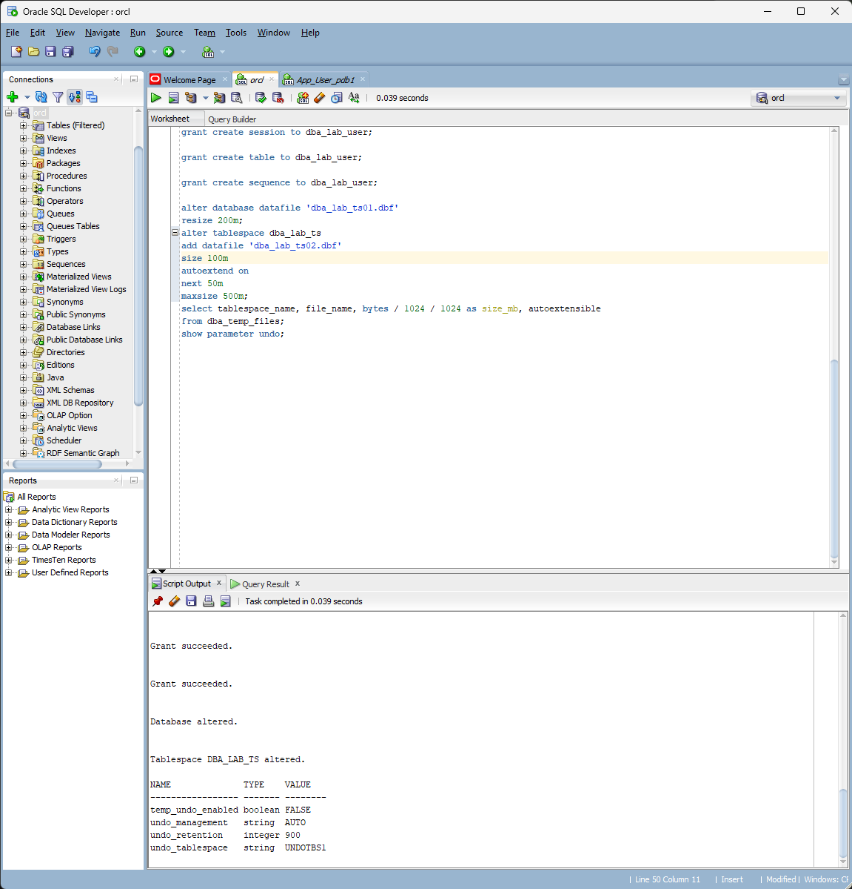

---

# Phase 15: Application Object Creation

After connecting as `DBA_LAB_USER`, an application table was created.

```sql
create table employees (
    emp_id number primary key,
    emp_name varchar2(100),
    salary number
);
```

The table location was verified.

```sql
select table_name,
       tablespace_name
from user_tables;
```

The result confirms that the object is stored in the assigned application tablespace.

```text
EMPLOYEES    DBA_LAB_TS
```


---

# Phase 16: Datafile Capacity Expansion

The application tablespace capacity was increased using two different approaches.

---

### Step 16.1: Resize Existing Datafile

The existing datafile was resized.

```sql
alter database datafile 'dba_lab_ts01.dbf'
resize 200m;
```

This increases the capacity of the existing physical datafile.

---

### Step 16.2: Add Additional Datafile

A second datafile was added to the same tablespace.

```sql
alter tablespace dba_lab_ts
add datafile 'dba_lab_ts02.dbf'
size 100m
autoextend on
next 50m
maxsize 500m;
```

The storage architecture becomes:

```text
DBA_LAB_TS
│
├── dba_lab_ts01.dbf
│   └── Resized to 200 MB
│
└── dba_lab_ts02.dbf
    └── Initial Size: 100 MB
```


---

# Phase 17: TEMP and UNDO Verification

The TEMP tablespace files were checked.

```sql
select tablespace_name,
       file_name,
       bytes / 1024 / 1024 as size_mb,
       autoextensible
from dba_temp_files;
```

The UNDO configuration was checked using:

```sql
show parameter undo;
```

This verifies the database's current UNDO-related configuration.

---

# 📊 Complete Project Workflow

```text
Virtual Machine Creation
        ↓
Oracle Linux 8
        ↓
Oracle User & Group Configuration
        ↓
Oracle Environment Verification
        ↓
Oracle 19c Installation Verification
        ↓
Database Startup
        ↓
CDB / PDB Verification
        ↓
PDB SAVE STATE
        ↓
Oracle Listener Management
        ↓
Database Shutdown & Restart
        ↓
Remote SSH Administration
        ↓
Oracle Net Configuration
        ↓
Oracle SQL Developer Connection
        ↓
Tablespace Health Monitoring
        ↓
Create Application Tablespace
        ↓
Create Application User
        ↓
Grant Required Privileges
        ↓
Create Application Table
        ↓
Resize Existing Datafile
        ↓
Add New Datafile
        ↓
TEMP & UNDO Verification
```

---

# 🧠 Skills Demonstrated

## Oracle Database Administration

- Oracle Database 19c
- SQL*Plus Administration
- SYSDBA Access
- Database Startup and Shutdown
- Instance Monitoring
- Database Status Verification

## Oracle Multitenant Architecture

- Container Database (CDB)
- Pluggable Database (PDB)
- PDB Management
- `PDB$SEED`
- `PDB1`
- PDB `SAVE STATE`
- Container Switching

## Oracle Linux Administration

- Linux User Management
- Linux Group Management
- Oracle Environment Variables
- `.bash_profile`
- Oracle Home
- Oracle SID
- Process Monitoring
- Filesystem and Environment Verification

## Oracle Networking

- Oracle Listener
- Port 1521
- Dynamic Service Registration
- Oracle Net
- `tnsnames.ora`
- Remote Database Connectivity

## Remote Administration

- SSH
- MobaXterm
- Remote Oracle Database Administration
- Remote Listener Management

## Oracle Storage Management

- Tablespaces
- Datafiles
- Free Space Monitoring
- Tablespace Usage Reporting
- AUTOEXTEND
- Datafile Resize
- Add Datafile
- TEMP Tablespace
- UNDO Configuration

## Security & User Management

- Database User Creation
- Default Tablespace Assignment
- Temporary Tablespace Assignment
- Storage Quota
- System Privileges
- Application User Connectivity

---

# ⚠️ Important Note

This project documents a hands-on Oracle 19c administration environment.

The Oracle Database software was already available in the lab environment and was verified through:

- Oracle Home
- Oracle environment variables
- OPatch inventory
- Oracle background processes
- SQL*Plus
- Oracle Listener
- Oracle configuration files
- Database services

Therefore, this project focuses on the **verification, configuration, administration, remote access, and storage management** of the Oracle 19c environment.

---

# 🔐 Security Note

The database credentials used in this project are intended only for a local learning environment.

For a production environment:

- Use strong passwords
- Do not expose database credentials
- Follow the principle of least privilege
- Restrict SYSDBA access
- Use proper credential management
- Follow organizational security policies

---

# 👨‍💻 Author

**Kushal Patel**

Oracle DBA | Oracle Linux | SQL | Database Administration

GitHub: [kushal267](https://github.com/kushal267)
